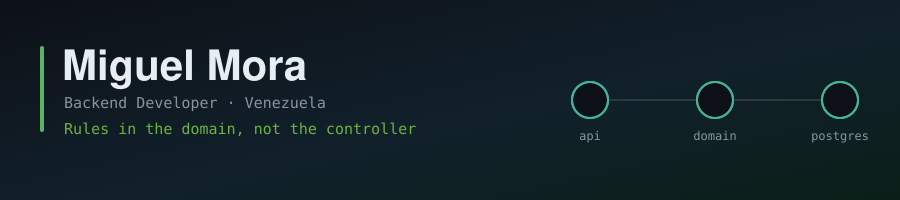

<div align="center">



[](https://migueldevplusplus.github.io)
[](mailto:amvmiguelito@gmail.com)

</div>

---

## About me

```java
public class Miguel {

    private final String role     = "Backend Developer";
    private final String based    = "Venezuela";
    private final String studying = "Software Engineering @ UNEG";

    public String howIWork() {
        return "Model the data first. Put the rules where they belong. Then build around it.";
    }

    public Map<String, String> currently() {
        return Map.of(
            "Clinic Book", "Scheduling API — Spring Boot 4, hexagonal architecture",
            "FarmaHumana", "Data Coach — database architecture for a pharmacy ecosystem",
            "Learning",    "Query optimization, testing strategy, distributed data"
        );
    }
}
```

I work on the part of a system that is expensive to get wrong: the schema and the business rules. Most bugs I have chased were not bad code — they were a data model that allowed something it never should have.

---

## 🏥 Clinic Book — main project

**Java 21 · Spring Boot 4 · PostgreSQL · Flyway · Docker · Testcontainers** · [**Repository →**](https://github.com/migueldevplusplus/clinic-book-app)

A medical appointment scheduling API with four roles, JWT authentication and an availability engine that derives free slots from each doctor's weekly schedule and consultation length — nothing is stored that can be computed.

Built with **ports and adapters**: the domain package imports nothing from Spring, JPA or the web, so the booking rules are tested in milliseconds without a database. What that architecture buys, concretely:

- The appointment lifecycle is a real **state machine** — `complete()` on a pending appointment throws no matter which endpoint asked
- Booking calls the same availability function the client uses, so **what you see and what you can book never disagree**
- Ownership is enforced beyond roles: having the `DOCTOR` role does not let you close someone else's appointment
- Schema ships as **versioned Flyway migrations**, replayed on an empty PostgreSQL container on every build

---

## Experience

### 🧬 Data Coach — FarmaHumana
**FastAPI · SQLAlchemy 2.0 · PostgreSQL · Alembic · Docker** · 3 months

A digital pharmacy ecosystem — e-commerce plus medication tracking — built for a real pharmacy as part of the Software Engineering programme at UNEG. I owned the database architecture for **both systems** and set the standards the rest of the team built against, coordinating a team of **~8 developers**.

Decisions I designed and defended:

- **Joined-table inheritance** for identity — `User → Customer, Employee, Doctor, Patient` — so one person is one identity, with role-specific data in its own table
- A **hierarchical catalogue**: active ingredient → medication → presentation → product variant, so pricing and stock live at the right level instead of being duplicated per SKU
- **`doctor_patient_links`** as the single source of truth for the doctor–patient relationship, rather than inferring it from prescriptions
- **`medication_possession_confirmations`** as the anchor that starts a treatment — a tracked plan begins when the patient actually holds the medication, not when it is prescribed
- A **Super-Admin approval flow** for patient accounts
- Team-wide conventions: one repository per aggregate root, soft deletes through `disabled_at`, and explicit `to_domain()` / `to_model()` mappers at the persistence boundary
- **Vector search with pgvector** and HNSW indexes

---

## Also

### 📊 [Automated Weekly Sales Report](https://github.com/migueldevplusplus/automated-report)
**Python · Pandas · OpenPyXL**

A pipeline that validates incoming CSVs, computes weekly KPIs against historical baselines, fills a styled Excel template, bundles the output into a dated ZIP and emails it to stakeholders. Python does the computation and validation; Excel does the presentation.

---

## Stack

<div align="center">


</div>

---

<div align="center">

**Open to backend and data engineering roles.**

[](https://migueldevplusplus.github.io)
[](mailto:amvmiguelito@gmail.com)

</div>
